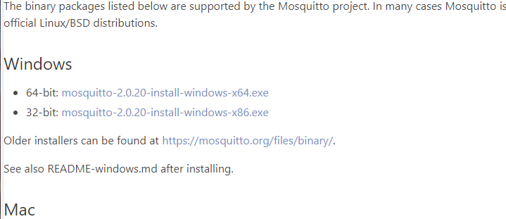
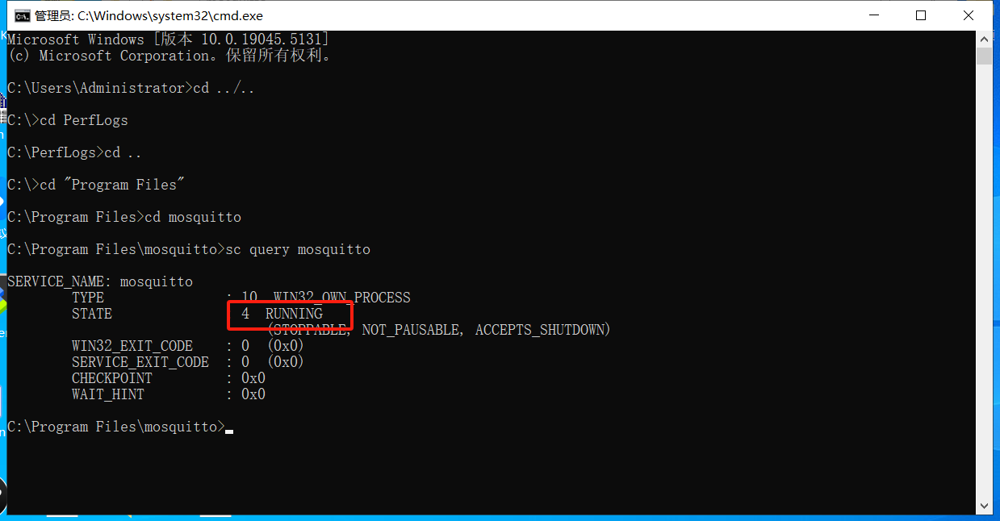
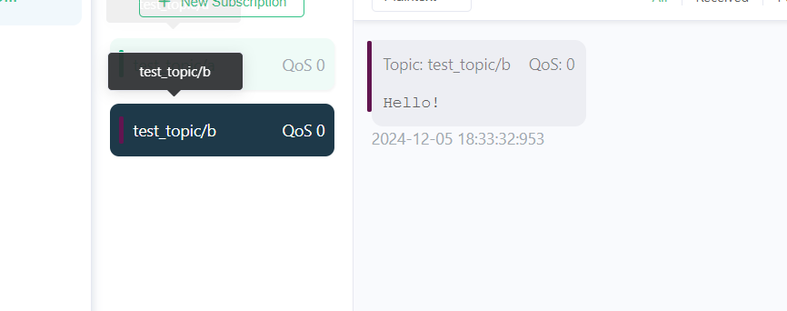
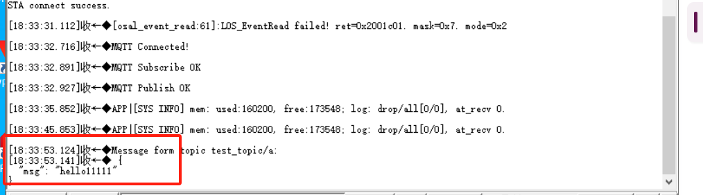

# 润和星闪派物联网开发套件--（MQTT）MQTT和PC端进行MQTT通信


[润和星闪派物联网开发套件](https://item.taobao.com/item.htm?abbucket=16&id=816685710481&ns=1&priceTId=214783b117346662457694855ed644&skuId=5533042544092&spm=a21n57.sem.item.49.46a639031zWytE&utparam=%7B%22aplus_abtest%22%3A%22b28048df8f009463834be6bdac2a3713%22%7D&xxc=taobaoSearch) 基于海思WS63E解决方案的一套软硬件组合的综合性开发套件。


## 一、如何编译

1. 将20_mqtt_demo、paho_mqtt目录复制到openharmony源码的`applications\sample\wifi-iot\app`目录下，
2. 修改openharmony源码的`applications\sample\wifi-iot\app\BUILD.gn`文件，将其中的 `features` 改为：

```
    features = [
        ...
        "20_mqtt_demo:mqtt_demo",                           # 案例程序模块
        "paho_mqtt/MQTTPacket/src:paho-embed-mqtt3c",       # MQTTPacket模块
        "paho_mqtt/MQTTClient-C/src:paho-embed-mqtt3cc",    # MQTTClient-C模块
        "14_easy_wifi/src:easy_wifi",                          # EasyWiFi模块
        ...
    ]
```
3. 在`device\soc\hisilicon\ws63v100\sdk\build\config\target_config\ws63\config.py`文件中，找到`'ws63-liteos-app'`部分，在其`'ram_component'`中，注释以下代码：
```
#"mqtt"
```

4. 在`device\soc\hisilicon\ws63v100\sdk\build\config\target_config\ws63\config.py`文件中，找到`'ws63-liteos-app'`部分，在其`'ram_component'`中，添加以下代码：
```
"mqtt_demo", "paho-embed-mqtt3c", "paho-embed-mqtt3cc", "easy_wifi",
```

5. 在`device\soc\hisilicon\ws63v100\sdk\libs_url\ws63\cmake\ohos.cmake`文件中，找到`"ws63-liteos-app"`部分，在其`set(COMPONENT_LIST`部分，添加以下代码：
```
"mqtt_demo"  "paho-embed-mqtt3c" "paho-embed-mqtt3cc"  "easy_wifi"
```
6. 在openharmony sdk根目录目录执行：`rm -rf out && hb set -p nearlink_dk_3863 && hb build -f`


## 二、实验步骤
1. 实验的演示功能是让WS63开发板和电脑端通过Eclipse Mosquitto搭建的本地MQTT服务器实现消息转发。

2. 电脑和WS63连接同一个Wifi。

3. 进入Eclipse Mosquitto官网下载windows版本的安装程序（下载链接https://mosquitto.org/download）。
  

4. 打开 Mosquitto 的安装目录，找到配置文件，默认的配置文件的路径是 C:\Program Files\mosquitto\mosquitto.conf ,根据实际情况修改。

5. 编辑配置文件（用文本编辑器如 Notepad++ 打开）以设置基本参数，直接添加如下内容到配置文件中即可。
allow_anonymous true          
listener 1888      
  
allow_anonymous true 表示允许匿名登录
listener 1888 表示使用1888端口，注意不能和电脑中其他服务使用的端口重复

6. 打开cmd ,进入 Mosquitto 的安装目录，命令：cd "C:\Program Files\mosquitto"

7. 安装 Mosquitto 服务，命令：mosquitto install

8. 启动服务，命令：net start mosquitto

9. 检查服务状态，命令：sc query mosquitto，如果打印是Running状态，表示启动成功。
  
10. 电脑下载MQTTX客户端工具（下载链接https://mqttx.app/zh）。
  
11. 创建一个新的连接，用户名随意，host地址要配置为电脑的ip地址，port配置为1888。
  
12. 点击Connect,连接Mosquitto服务器。
  
13. 复位WS63开发板，等待WS63开发板初始化完成，WS63开发板会主动尝试连接Mosquitto服务器，连接成功后，WS63会向topic/b主题发送一条消息
  
14. MQTTX客户端向topic/a主题发送消息,WS63串口会打印消息。
  


### 【套件支持】

##### 1. 套件购买  https://item.taobao.com/item.htm?abbucket=16&id=816685710481&ns=1&priceTId=214783b117346662457694855ed644&skuId=5533042544092&spm=a21n57.sem.item.49.46a639031zWytE&utparam=%7B%22aplus_abtest%22%3A%22b28048df8f009463834be6bdac2a3713%22%7D&xxc=taobaoSearch

##### 2. 技术资料

- Gitee码云网站（使用说明书、规格说明书、OpenHarmony开发案例等） **https://gitee.com/hihopeorg_group/near-link**
- fbb_ws63代码仓（SDK包、技术文档下载）**https://gitee.com/HiSpark/fbb_ws63**

##### 3. 互动交流
- 海思社区星闪专区-论坛 **https://developer.hisilicon.com/forum/0133146886267870001**
